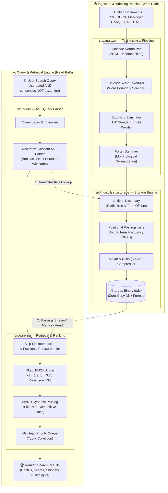

# 🚀 Argus — High-Performance Full-Text Search Engine

[](https://www.npmjs.com/package/argus-search)
[](https://www.typescriptlang.org/)
[](https://nodejs.org/)
[](https://bun.sh/)
[](https://vitest.dev/)
[](LICENSE)

> **Full-text search at in-memory speed. Zero dependencies. 100% local privacy.**

**Argus** is a high-performance, deterministic full-text search engine built from first principles with mechanical sympathy for JavaScript runtimes (V8 in Node.js, Bun, and modern browsers). It delivers the ranking precision and query power of **Elasticsearch** without Java runtimes, cloud subscriptions, or heavy memory footprints. 

Operates 100% locally in client browser memory with `IndexedDB` persistence, as an interactive shell CLI, or as a zero-dependency REST daemon.

---

## 💡 Why Argus? (The Search Problem)

Searching through personal and engineering knowledge has historically forced developers into painful trade-offs:

1. **Simple In-App Search (`Ctrl + F` in Word / Acrobat):**
   * Can only search **one file at a time**. You must already know which file to open.
   * Has no concept of relevance ranking (jumps linearly through text).
   * Misses linguistic variations (searching `consulting` misses `consultant` and `consults`).
2. **Heavy Enterprise Engines (Elasticsearch / OpenSearch):**
   * Require a Java Virtual Machine (JVM), Docker containers, and hundreds of megabytes of RAM just to boot idle.
   * Massive operational complexity for personal tools, static sites, edge runtimes, or local CLIs.
3. **Cloud SaaS (Algolia / Meilisearch Cloud):**
   * Expensive subscriptions and network latency (50–150 ms round trips).
   * **Severe Privacy Risks:** Requires uploading your private resumes, financial statements, contracts, or codebases to a third-party server.
4. **Existing JavaScript Libraries (Fuse.js / Lunr.js):**
   * *Fuse.js* relies on quadratic $O(N)$ brute-force scanning—slowing down rapidly past a few hundred documents.
   * *Lunr.js* uses outdated 1970s un-normalized TF-IDF, uncompressed JSON blobs, and lacks positional phrase verification.

**Argus solves this permanently**: A complete, zero-dependency Information Retrieval (IR) core that runs across **PDFs, Word docs, Markdown, Code, HTML, and JSON** in **0.3 milliseconds** directly in your browser or terminal with **100% local privacy**.

---

## 📊 Feature Comparison Matrix

| Feature | Microsoft Word (`Ctrl + F`) | Elasticsearch | Cloud SaaS (Algolia) | Fuse.js / Lunr.js | **Argus Engine** |
| :--- | :--- | :--- | :--- | :--- | :--- |
| **Search Scope** | Single file at a time | Entire cluster | Entire cluster | In-memory array | **All files simultaneously** |
| **Runtime Overhead** | 3–5s app launch | Heavy JVM + Docker | Cloud network API | None | **Zero (Native JS/TS)** |
| **Data Privacy** | Local file | Self-hosted server | ⚠️ Sent to cloud | Local | **🛡️ 100% Local (Zero Bytes Leave Device)** |
| **Ranking Algorithm** | None (linear jump) | Okapi BM25 | Proprietary Typo | Basic / Raw TF-IDF | **🎯 Okapi BM25 ($k_1, b$) + WAND** |
| **Linguistic Stemming** | None (exact string) | Heavy analyzers | Server-side | Basic | **Morphological Porter Stemmer (NFKD)** |
| **Supported Formats** | Only `.docx` | Requires parsers | Pre-parsed JSON | Plain text / Objects | **PDF, Word, Code, Markdown, JSON, HTML** |
| **Query Engine** | Plain string | Full DSL | Restricted | Substring / Simple | **Recursive-Descent AST (`AND`, `OR`, `NOT`, `" "`)** |
| **Disk Compression** | N/A | Lucene segments | N/A | Raw JSON (bloated) | **🗜️ VByte + Delta D-Gaps (70%+ space savings)** |
| **Latency** | 2 – 5 seconds | 10 – 30 ms (network) | 50 – 150 ms (WAN) | 15 – 80 ms (CPU scan) | **⚡ 0.2 – 0.5 ms (In-Memory)** |

---

## ⚡ Key Highlights

- ⚡ **Zero External Dependencies:** Built 100% from first principles. Tokenizers, normalizers, stemmers, compression codecs, and data structures contain zero `npm` packages.
- 🛡️ **100% Local-First Privacy:** When searching in the browser studio, zero bytes leave your computer. Documents are parsed and indexed in client RAM and persisted in `IndexedDB`.
- 📁 **Unified Multi-Format Ingestion:** Search across **PDFs** (with coordinate layout extraction), **Word** (`.docx`), **PowerPoint** (`.pptx`), **Markdown**, **HTML**, **JSON data**, **CSV spreadsheets**, and **source code** in a single unified index.
- 🎯 **Probabilistic Ranking (Okapi BM25):** Tunable term frequency saturation ($k_1$) and document length normalization ($b$) combined with Robertson-Spärck Jones IDF and MinHeap top-$K$ extraction.
- 🧠 **Mechanical Sympathy for V8:** Operates on contiguous typed buffers (`Uint8Array`, `Uint32Array`, `Float32Array`) rather than millions of fragmented JavaScript objects, eliminating GC latency.
- 🗜️ **Compact Binary Disk Persistence:** Serializes indexes into a custom `.argus` binary format using Variable-Byte (Varint) encoding and Delta (d-gap) integer compression (70%+ reduction vs raw JSON).
- 🔍 **Expressive Query AST Engine:** Full boolean algebra (`AND`, `OR`, `NOT`), parentheses grouping, exact phrase search via positional postings, and prefix matching.
- ⏩ **Sub-Millisecond Query Latency:** Skip pointers on postings lists and dynamic WAND (Weak AND) pruning deliver sub-millisecond median query times (`0.2ms – 0.5ms`).
- 🖥️ **Interactive Studio & Web UI:** Built-in web playground featuring live morphological stem transformations (`word → stem`), BM25 score breakdown table ($TF$, $IDF$, normalized score), and hardware telemetry.
- 💻 **Dual CLI & Programmatic Library:** Usable as a command-line indexing tool (`argus index`, `argus search`, `argus serve`) or imported directly into Node.js / Bun backend applications.

---

## 📐 System Architecture

Argus decouples the **Ingestion & Indexing Pipeline (Write Path)** from the **Query Execution & Ranking Pipeline (Read Path)**:



---

## 🛠️ Tech Stack

| Layer | Technology | Purpose |
|---|---|---|
| **Runtime** | Node.js (>= 20.0.0) / Bun (>= 1.1.0) | High-performance JavaScript execution |
| **Language** | TypeScript 5.x | Strict static typing, type safety, and zero-cost abstractions |
| **Memory & Storage** | TypedArrays (`Uint8Array`, `Uint32Array`), Buffer | Zero-GC binary memory buffers & `.argus` file serialization |
| **Algorithms** | Porter Stemmer, Okapi BM25, Varint, WAND | Text normalization, ranking, compression & dynamic pruning |
| **Testing & CI** | Vitest, GitHub Actions | Unit, integration, and benchmark verification |

---

## 🔬 Deep Dive: Engine Internals

### 1. Text Analysis & Tokenization Pipeline (`src/analyzer`)
- **Character Filter**: Normalizes Unicode strings via NFKD decomposition, strips diacritics, and handles accent stripping.
- **Tokenizer**: Splits character streams along unicode word boundaries (`/[^\p{L}\p{N}_]+/u`), emitting tokens with byte start/end positions for snippet generation.
- **Stopword Filter**: Removes high-frequency, low-entropy words using a fast lookup set.
- **Porter Stemmer**: An algorithmic stemmer that reduces morphological variations to their root form (e.g., `retrieval`, `retrieving`, `retrieved` $\to$ `retriev`).

### 2. Inverted Index with Positional Postings (`src/index`)
- **Lexicon (Term Dictionary)**: A high-performance trie storing term statistics (Document Frequency $df$, Total Term Frequency $ttf$, and disk byte offsets).
- **Positional Postings Lists**:
  ```typescript
  interface Posting {
    docId: number;          // Monotonically increasing document ID
    termFrequency: number;  // Occurrences in document
    positions: number[];    // 0-indexed word offsets for phrase verification
  }
  ```
- **Skip Lists**: Skip pointers placed every $\lfloor\sqrt{L}\rfloor$ entries enable jumping over large blocks of non-matching documents during multi-term `AND` queries in $O(\min(N, M))$ time.

### 3. Binary Disk Storage & Compression (`src/storage`)
- **Delta Encoding (D-Gaps)**: Converts strictly increasing document IDs into small integer differences:
  $$\text{Raw IDs: } [104, 108, 125, 160] \implies \Delta\text{-Gaps: } [104, 4, 17, 35]$$
- **Variable-Byte (Varint / VByte) Encoding**: Encodes arbitrary 32-bit unsigned integers into 7 bits per byte, reserving the 8th bit as a continuation flag. Small delta numbers compress from 4 bytes down to 1 byte.
- **Binary Format Header**: Magic bytes (`0x41 0x52 0x47 0x53`), version tag, document count, term count, average document length, followed by dictionary offset tables and compressed postings blobs.

### 4. Relevance Scoring & Ranking (`src/ranking`)
- **Okapi BM25 Formulation**:
  $$\text{Score}(D, Q) = \sum_{t \in Q} \text{IDF}(t) \cdot \frac{f(t, D) \cdot (k_1 + 1)}{f(t, D) + k_1 \cdot \left(1 - b + b \cdot \frac{|D|}{\text{avgdl}}\right)}$$
  Where:
  - $f(t, D)$ is the term frequency in document $D$.
  - $|D|$ and $\text{avgdl}$ represent document length and average corpus length.
  - $k_1 = 1.2$ (controls term saturation) and $b = 0.75$ (controls document length penalization).
  - Robertson-Spärck Jones IDF:
    $$\text{IDF}(t) = \ln \left( \frac{N - n(t) + 0.5}{n(t) + 0.5} + 1 \right)$$
- **Top-K Retrieval**: Utilizes a fixed-size binary `MinHeap` priority queue to retain the top $K$ results without sorting the full matching set.

### 5. Query AST Parser & Evaluation Plan (`src/query`)
- **Lexer & Recursive-Descent Parser**: Builds an Abstract Syntax Tree (AST) supporting:
  - **Terms**: `database`
  - **Boolean AND**: `distributed AND consensus`
  - **Boolean OR**: `rust OR typescript`
  - **Negation**: `engine NOT storage`
  - **Exact Phrases**: `"byzantine fault tolerance"` (verified via positional index)
  - **Prefixes**: `distrib*`
- **WAND (Weak AND) Dynamic Pruning**: Calculates maximum score contributions per term to prune non-competitive candidate documents early.

---

## 🚀 Getting Started

### ⚡ Quick Install via npm
```bash
# As a library dependency
npm install argus-search

# Or run CLI directly via npx
npx argus-search --help
```

### 🛠️ Building From Source

#### 1. Prerequisites
- **Node.js** `>= 20.0.0` or **Bun** `>= 1.1.0`
- **npm**, **pnpm**, or **bun**

#### 2. Clone the Repository
```bash
git clone https://github.com/Krishnanand-10/Argus.git
cd Argus
```

### 3. Install Dependencies
```bash
npm install
```

### 4. Build the Engine
```bash
npm run build
```

---

## 🧭 CLI Commands & Usage

Argus includes an interactive CLI for indexing files and querying indexes directly from your shell:

```bash
# Index a folder of JSON, Markdown, or TXT documents
npx argus index --source ./docs --output ./indices/docs.argus

# Search an index with full boolean or phrase syntax
npx argus search --index ./indices/docs.argus "distributed consensus"

# Inspect index statistics (total documents, term count, file size)
npx argus stats --index ./indices/docs.argus

# Start a local HTTP search daemon (port 8080)
npx argus serve --index ./indices/docs.argus --port 8080
```

---

## 📦 Programmatic Library API

Argus can be embedded directly into any Node.js or TypeScript backend:

```typescript
import { ArgusEngine } from 'argus-search';

// 1. Initialize Engine
const engine = new ArgusEngine({
  k1: 1.2,
  b: 0.75,
  stopWords: true,
  stemming: true,
});

// 2. Add Documents
await engine.addDocuments([
  {
    id: 1,
    title: "Distributed Systems Architecture",
    body: "Consensus algorithms such as Paxos and Raft ensure high availability and fault tolerance.",
  },
  {
    id: 2,
    title: "Search Engines from First Principles",
    body: "Inverted indexes, postings lists, and Okapi BM25 ranking provide sub-millisecond retrieval.",
  },
]);

// 3. Serialize Index to Disk (.argus binary)
await engine.commit('./data/library.argus');

// 4. Query with Boolean & Phrase Filters
const results = await engine.search('consensus AND "fault tolerance"', { limit: 5 });

console.log(results);
/*
[
  {
    docId: 1,
    score: 2.8415,
    matchedTerms: ["consensus", "fault", "toler"],
    snippet: "...ensure high availability and **fault tolerance**."
  }
]
*/
```

---

## 📁 Project Structure

```
Argus/
├── .github/
│   └── workflows/
│       └── ci.yml               # Automated tests & linting
├── bin/
│   └── argus.ts                 # CLI executable
├── src/
│   ├── analyzer/                # Text Processing Pipeline
│   │   ├── char-filter.ts       # Unicode normalization & diacritic strip
│   │   ├── tokenizer.ts         # Fast regex/stream word tokenizer
│   │   ├── stop-words.ts        # Standard English stopword filter
│   │   ├── stemmer.ts           # Porter Stemmer implementation
│   │   └── index.ts             # Composable analysis pipeline
│   ├── index/                   # Inverted Index & Postings
│   │   ├── postings-list.ts     # Positional postings array list
│   │   ├── skip-list.ts         # Skip pointer traversal
│   │   ├── dictionary.ts        # Lexicon Radix Tree / Trie
│   │   └── inverted-index.ts    # Main in-memory index structure
│   ├── storage/                 # Binary Serialization & Disk I/O
│   │   ├── vbyte.ts             # Variable-byte encoder / decoder
│   │   ├── delta.ts             # D-gap delta compressor
│   │   ├── serializer.ts        # Binary .argus writer (Buffer / Uint8Array)
│   │   ├── deserializer.ts      # Binary .argus reader with zero-copy offsets
│   │   └── wal.ts               # Write-ahead log for durability
│   ├── ranking/                 # Information Retrieval Algorithms
│   │   ├── bm25.ts              # Okapi BM25 scorer
│   │   ├── tfidf.ts             # Classic TF-IDF scorer
│   │   └── priority-queue.ts    # Min-Heap for Top-K extraction
│   ├── query/                   # Query Parser & Execution
│   │   ├── lexer.ts             # Query token scanner
│   │   ├── parser.ts            # Recursive-descent AST parser
│   │   ├── ast.ts               # AST Node type definitions
│   │   ├── evaluator.ts         # Query plan executor
│   │   └── wand.ts              # Weak AND (WAND) dynamic pruner
│   ├── server/                  # Optional REST API
│   │   └── server.ts            # Lightweight HTTP search endpoint
│   └── index.ts                 # Public SDK exports
├── tests/                       # Unit & Integration Tests (Vitest)
│   ├── analyzer.test.ts
│   ├── compression.test.ts
│   ├── inverted-index.test.ts
│   ├── bm25.test.ts
│   └── query-parser.test.ts
├── benchmarks/                  # Performance Benchmarks
│   └── search-benchmark.ts      # Throughput and latency profiling
├── .gitignore
├── LICENSE
└── README.md
```

---

## 🧪 Running Tests

Argus uses **Vitest** for fast unit, integration, and property-based test suites:

```bash
# Run all tests
npm test

# Run tests in watch mode
npm run test:watch

# Generate code coverage report
npm run test:coverage
```

---

## 📄 License

MIT © 2026 Krishnanand Tiwari
